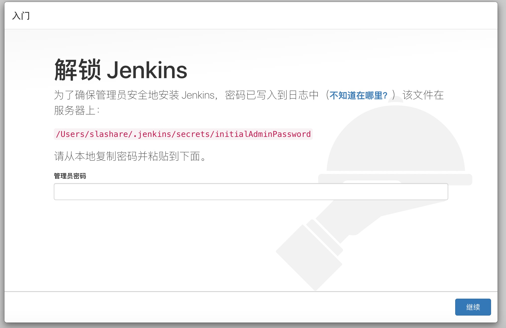
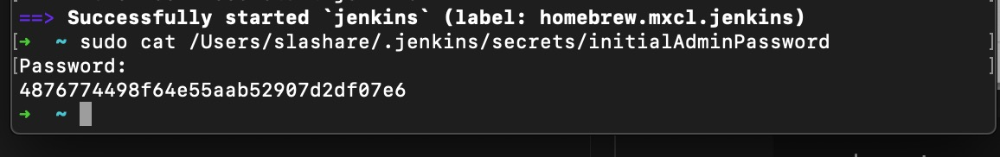
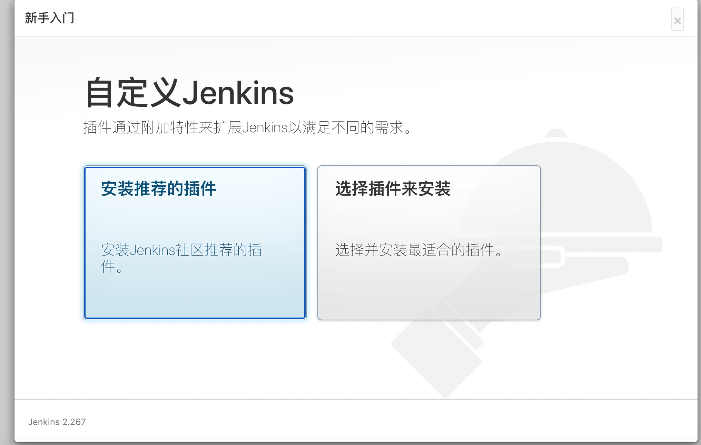
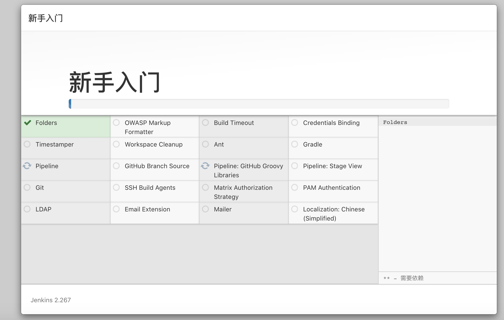
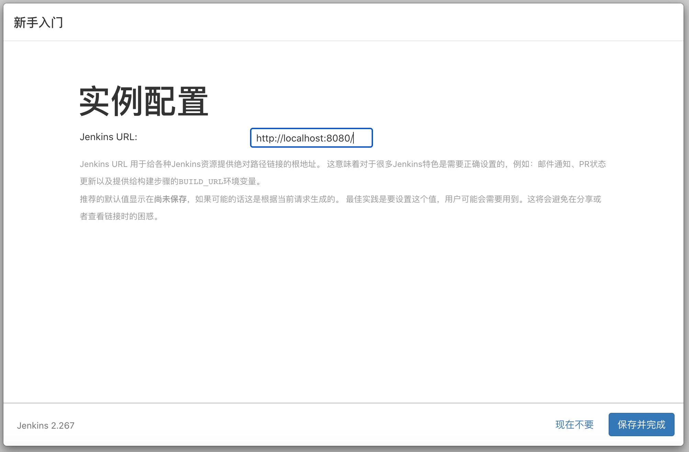
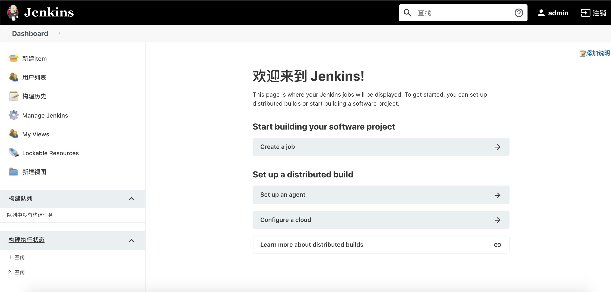

1. 下载 https://www.jenkins.io/

   Jenkins是一个独立的开源软件项目，是***基于Java开发的***一种持续集成工具，用于监控持续重复的工作，旨在提供一个开放易用的软件平台，使软件的持续集成变成可能

+ 安装Java

+ 安装jenkins

        brew install jenkins // 安装最新版本

2. 启动Jenkins 服务

        brew services start jenkins  // 会以服务的形式启动

        jenkins: 当前窗口启动

        默认端口8080

        http://localhost:8080/login?from=%2F

3. 重启jenkins

        brew services restart jenkins

4. 更新jenkins 

         brew upgrade jenkins

5. 配置（不一定需要）

        For the system Java wrappers to find this JDK, symlink it with
        sudo ln -sfn /usr/local/opt/openjdk@11/libexec/openjdk.jdk /Library/Java/JavaVirtualMachines/openjdk-11.jdk

        openjdk@11 is keg-only, which means it was not symlinked into /usr/local,
        because this is an alternate version of another formula.

        If you need to have openjdk@11 first in your PATH run:
        echo 'export PATH="/usr/local/opt/openjdk@11/bin:$PATH"' >> ~/.zshrc

        For compilers to find openjdk@11 you may need to set:
        export CPPFLAGS="-I/usr/local/opt/openjdk@11/include"

6. 访问jenkins

        http://localhost:8080
    
   

        sudo cat /Users/slashare/.jenkins/secrets/initialAdminPassword

   
   
   
   
   
   