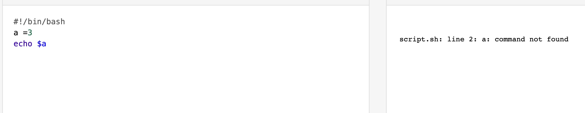

1. 变量名和等号之间不能有空格，和其他所有的编程语言都不一样

        a=3

   

2. 使用变量$name或者${name},必须用$(美元符号),不然会被当做普通字符串

        a=3

        echo  a  // a
        echo $a  //3

3. 只读变量

        readonly a=3

4. 删除变量

        unset a

5. 变量类型

> String: 单引号或双引号

> 数组： (a,b,c,d)