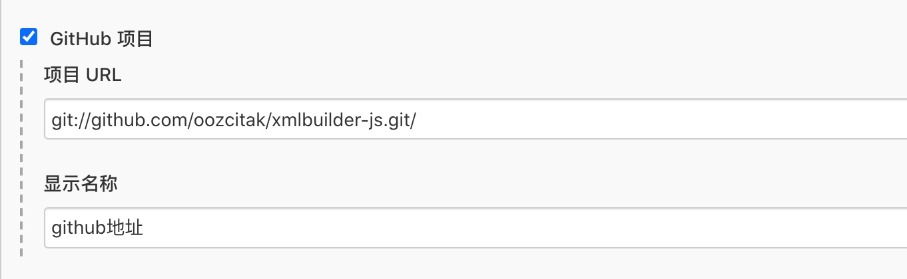
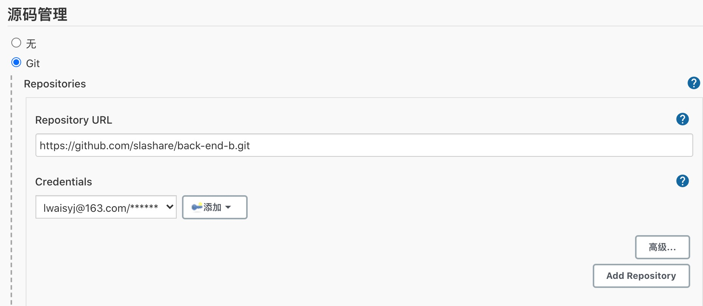
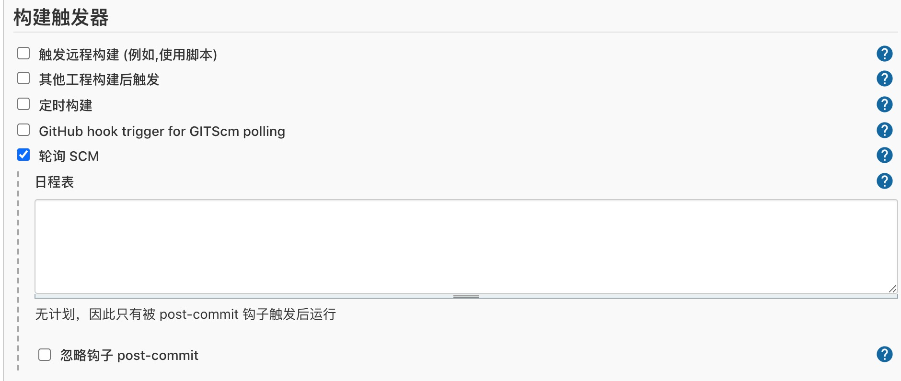
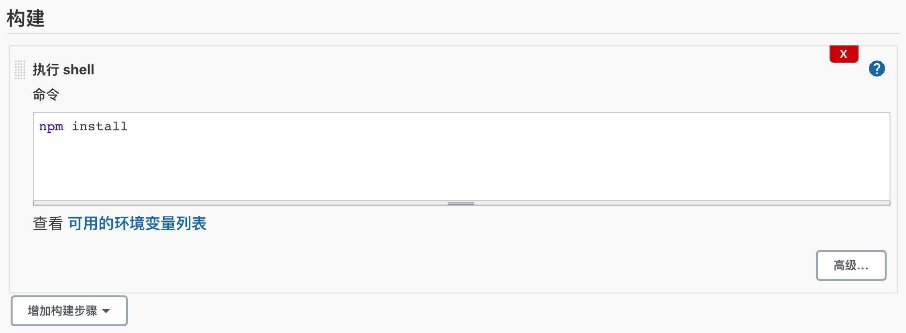

0. 查看配置

      http://localhost:8080/job/test/config.xml

1. 根节点

        <project>

        </project>

2. 任务描述

        <project>
           <description>
              描述
           </description>
        </project>

   

3. git 项目

        <project>
           <description>
              描述
           </description>
           <properties>
                <com.coravy.hudson.plugins.github.GithubProjectProperty plugin="github@1.32.0">
                    <projectUrl>git://github.com/oozcitak/xmlbuilder-js.git/</projectUrl>
                    <displayName>github地址</displayName>
                </com.coravy.hudson.plugins.github.GithubProjectProperty>
                </properties>
        </project>

   

4. 配置git

        <scm class="hudson.plugins.git.GitSCM" plugin="git@4.4.5">
            <configVersion>2</configVersion>
            <userRemoteConfigs>
            <hudson.plugins.git.UserRemoteConfig>
               <url>https://github.com/slashare/back-end-b.git</url>
               <credentialsId>48e6b61f-62d0-4a4d-b02d-f8b3d5042583</credentialsId>
            </hudson.plugins.git.UserRemoteConfig>
            </userRemoteConfigs>
            <branches>
               <hudson.plugins.git.BranchSpec>
               <name>*/dev</name>
               </hudson.plugins.git.BranchSpec>
            </branches>
            <doGenerateSubmoduleConfigurations>false</doGenerateSubmoduleConfigurations>
            <submoduleCfg class="list"/>
            <extensions/>
        </scm>

   
   

5. 轮询scm

         <triggers>
            <hudson.triggers.SCMTrigger>
            <spec/>
            <ignorePostCommitHooks>false</ignorePostCommitHooks>
            </hudson.triggers.SCMTrigger>
         </triggers>
   
    

6. 构建

         <builders>
            <hudson.tasks.Shell>
               <command>npm install</command>
               <configuredLocalRules/>
            </hudson.tasks.Shell>
         </builders>

   